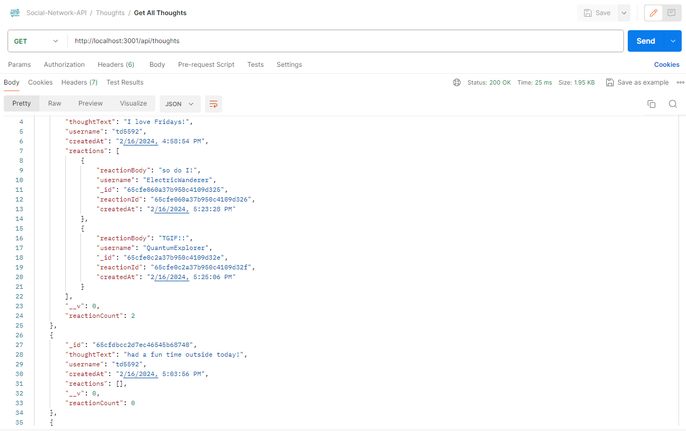

# NoSQL Social Network API

## License

This project is licensed under the [MIT License] - see [LICENSE](LICENSE) file for more details.

## Description

This is an API for a social network web application that empowers users to share thoughts, react to their friends' thoughts, and create a personalized friend list. Built using Mongoose (MongoDB), Express, and Node.js, this API provides a robust backend infrastructure to support the dynamic and interactive features of the social network.

## Table of Contents

- [License](#license)
- [Description](#description)
- [Demonstration](#demonstration)
- [Screenshots](#screenshots)
- [Usage](#usage)
- [Technologies](#technologies)
- [Questions](#questions)

## Demonstration

[Click Here to View Video Demonstration](https://screenpal.com/watch/cZnbbcVdM1i)

## Screenshots

 

## Usage

### Install

- Clone or Fork the repository from Github to your local machine.
- Open using a source code editor like VScode.
- Open the integrated terminal in the root directory and type the command `npm install` to make the necessary dependency installations. 

### Start the Server

- Once installations are complete, type the command `npm run start` or `node index.js` to start the server.
- Open Postman or a similar tool to run tests on the API endpoints
- The server will be running http://localhost:3001 

### Test Routes

Make sure to include necessary data in the header and body of your requests. Use the following endpoints: 

- /api/users - GET all users and POST a new user
- /api/users/:id - GET a single user, PUT to update a user, and DELETE a user and their associated thoughts. 
- /api/users/:userId/friends - POST a new friend to friendlist
- /api/users/:userId/friends/friendId - DELETE a friend off friendlist
- /api/thoughts - GET all thoughts, POST a new thought and push to associated user's thoughts array
- /api/thoughts/:thoughtId - GET a single thought, PUT to update a thought, DELETE a thought
- /api/thoughts/:thoughtId/reactions - POST a new reaction
- /api/thoughts/:thoughtId/reactions/:reactionId - DELETE a reaction

## Technologies

### Express [Version 4.18.2](https://expressjs.com/)

### Mongoose [Version 8.1.2](https://www.npmjs.com/package/mongoose)

### POSTMAN (https://www.postman.com/downloads/)

## Questions

[Follow me on Github!](https://github.com/Dossman-thomas)

Have any further questions? Feel free to reach me via tdossman.development@gmail.com